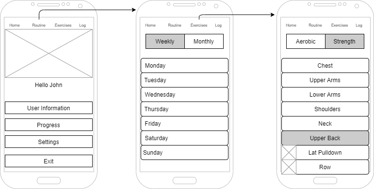

## Summary

This Android app will allow a user to create an exercise routine by choosing from a list of exercises based on the equipment the user has available. The list will include aerobic and resistance based exercises. The user then can keep track of their progress by entering information into an exercise log. The aerobic exercises will track time, distance and heart rate. The resistance exercises will track sets, repetitions, and weight. 

## Intended users

* People who are new to exercising and starting an exercise routine and want to keep track of their progress.  

    > As someone planning to start an exercise routine, I want to be able to pick from a list of exercises and keep track of my progress using a simple interface because the more "work" I have to put into this the less chance I have to starting and sticking to a new routine.

* People who are weight lifting and want an easy way to track their progress.

    > As someone with a full time job and a family, I want a faster and easier way to track my progress using my phone instead of a notebook so I can devote more time to other aspects of my life.

## Functionality

* User can create an exercise routine for aerobic training, resistance training, or both by picking from a list of exercises.

* User will be able to enter information as they complete each exercise.

* User will be able to pull up stored information so they can track their progress.

## Persistent data

* User info (name, height, weight).

* List of exercises.
    
    * If resistance exercise, muscle groups used (main and secondary).
    
    * Equipment needed for each exercise.

* List of exercises in user's routine, both current and past.

    * For aerobic exercises: time, distance, heart rate.

    * For resistance training: sets, repetitions, weight.
    
## Device/external services

* The list of resistance exercises from Google APIs for Android and/or wger Workout Manager.
    * https://developers.google.com/android/reference/com/google/android/gms/fitness/data/WorkoutExercises
    * https://wger.de/en/software/api

    * Access to these services would be during development to download the exercise information and store it in a SQL database. This would only require access to the service once. The wger database seems to have more information on each exercise but when I tried to browse the API I got what looked like test data so I'm not sure if I wasn't doing it right or if the API isn't usable.

* Access to the calendar for workout scheduling.
    * This app will access the calendar to determine which workout is scheduled for that day. The user will be able to pick a workout in case the calendar is unavailable or if they just want to do another routine that day.

## Stretch goals/possible enhancements 

* Progress can be seen using graphs.

* Pictures or videos showing the various exercises.

* User will be able to input exercises not on the list.

* Recommend exercise routines based on the user's goal (weight loss, strength, endurance, etc.) and fitness level (sedentary, mildly active, etc.).

## Wireframe

